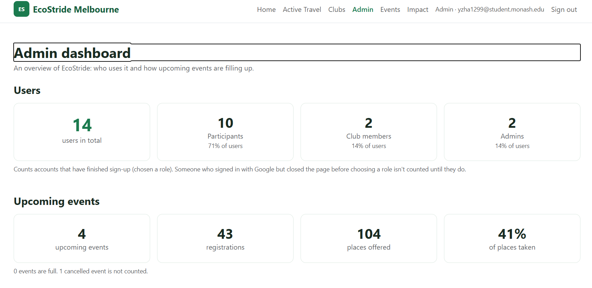

# EcoStride: innovation report (BR F.1)

**Project:** EcoStride Melbourne, a web app for a small environmental charity: community active-travel routes, club sustainability tools, and events people can register for.
**Live site:** https://ecostride-82c87.web.app · **API:** https://ecostride-api.ecostride.workers.dev
**Features delivered:** (1) an admin dashboard with a separate admin role, (2) interactive charts from Firestore data, (3) a public REST API for third parties, (4) GenAI drafting with Google Gemini.

F.1 allows innovations that enhance existing features. Each of these four builds on something the app already did well: roles and security rules, Firestore event data, the Cloudflare Worker API, and the email and event forms. So each is useful to a real user, not a demo bolted on.

---

## 1. How the four features were chosen

The brief lists seven example innovations. Each was scored against three things: what already existed to build on, the effort left before the deadline, and the risk of an assessor seeing it as a repeat of work already credited elsewhere.

| Option | Existing foundation | Effort | Risk | Decision |
| --- | --- | --- | --- | --- |
| Interactive charts | Events, registrations and users already in Firestore | Low | Low | **Chosen** |
| Admin dashboard | Role system, security rules and a rules test harness already in place | Medium | Low | **Chosen** |
| API access for third parties | Worker already has routing, validation, error format and logging | Low | Low | **Chosen** |
| GenAI (Gemini) | The Worker already proxies third-party services with server-held keys | Low-medium | Medium (quota, output quality) | **Chosen** |
| Offline features | Some local storage use | Low | Low, but less innovative | Recommended as future work |
| Bulk email to selected users | Bulk email to all registrants already built for D.2 | Low | High: overlaps D.2 | Future work |
| Calendar booking with conflict checks | Events have times and capacity, but registrations can't be queried across events | High | Medium | Future work |

The approach was the same as for D/E: a written spec, small tickets, tests at clear boundaries (security rules, pure data-shaping functions), and WCAG 2.1 AA for every new screen.

---

## 2. Feature 1: Admin dashboard and admin role

### Problem

The charity's staff had no view of their own platform. The only way to see how many people used EcoStride, or in what roles, was to open the Firestore console.

### What was built

- **A separate `admin` role.** It can't be chosen at sign-up and can't be set from a browser: the security rules only accept `participant` or `clubMember` when a profile is created, and nobody can change their role afterwards. Staff are made admins from the command line with the Admin SDK (`npm run make-admin -- <uid>`, and `--revoke` to undo).
- **Least-privilege rules.** An admin can read and count user profiles, which the dashboard needs, and nothing more: no editing profiles, no reading registrations (names, emails, needs), no creating events. Admin is an overview role, not a super-user.
- **The dashboard (`/admin`)**, shown in the header only to admins:
  - total users, and users by type (participants, club members, admins) with each type's share;
  - upcoming events, registrations, places offered and the fill rate, with full and cancelled events noted.
- User numbers come from Firestore **count aggregation queries**, so the browser gets totals, not every user's profile.

### Alternatives considered

- *Custom claims on the Firebase Auth token* for the role. This would save one Firestore read per rule check, but needs the Admin SDK on a server at sign-up and makes a role change wait for the token to refresh. The existing roles already live in Firestore, so the admin role follows the same pattern.
- *Admins as club members with extra powers.* Rejected: an overview role shouldn't be able to edit other clubs' events or read registrants' details.

### UX and accessibility

Every number appears as text, not only in the charts. Sections have headings. Non-admins who open `/admin` get the existing "Access denied" page, not a broken screen.

### Evidence

- 10 security-rules tests (`tests/rules/admin.rules.test.js`), run on the Firestore emulator. They cover: can't self-assign admin; admins can read and count profiles; others can't list users; admins can't change profiles or roles, read registrations or create events. Three deliberately broken versions of the rules were each caught by the tests.
- 5 unit tests for the event summary (`summariseEvents`): totals, full events, cancelled events excluded, no "0%" fill rate when there are no places, rounding.



*Figure 1. The admin dashboard on the live site. User numbers come from Firestore count queries; the event summary leaves out the cancelled event and says so.*

---

## 3. Feature 2: Interactive charts from Firestore

### Problem

Numbers alone hide patterns: how sign-ups are trending, which kinds of event draw people, which of a club's events are nearly full or struggling.

### What was built

Four bar charts (Chart.js 4 through `vue-chartjs`), all fed by live Firestore data:

| Where | Chart | Question it answers |
| --- | --- | --- |
| Admin dashboard | Users by role | Who is the platform serving? |
| Admin dashboard | New sign-ups per week (last 12 Melbourne weeks) | Is use growing? |
| Admin dashboard | Registrations and places left by event type (stacked) | Which kinds of event fill up? |
| Manage Events (club members) | Registered vs places left for each upcoming event (horizontal, stacked) | Which of my events need promoting? |

**Interactivity:**
- tooltips with exact values (and fill percentage);
- legends that show or hide a series;
- on Manage Events, **clicking a bar opens that event's roster**, so the chart is a way into the data, not just a picture.

**Accessibility**, through a shared `ChartPanel` component:
- a visible title and a one-sentence summary written from the data (for example, the Manage Events summary names the events under a quarter full). The summary is also the chart's `aria-describedby`;
- the canvas is `role="img"` with a name;
- a **"Show as table"** button (`aria-expanded`) reveals the same data as a real table with row headers;
- colours at least 3:1 against white, and stacked series differ in lightness as well as hue;
- animation is off for people who prefer reduced motion;
- keyboard users reach the same rosters from the table's existing Roster buttons.

**Performance:** both chart pages are loaded on demand, so Chart.js (about 170 kB) is downloaded only by admins and club members who open them, not by every visitor.

### Alternatives considered

| Library | Why not |
| --- | --- |
| Apache ECharts | Very capable, but much larger for four bar charts. |
| D3 | Maximum control, but every axis, tooltip and legend is hand-built; more code to maintain and explain. |
| Google Charts | Loaded from Google's servers at run time, which would widen the site's Content-Security-Policy. |
| **Chart.js** | Small, tree-shakeable (only bar-chart parts are registered), built-in tooltips and legends, well supported in Vue. |

### Correctness

The data shaping is in pure functions with unit tests (`src/utils/dashboard.test.js`, 17 tests):
- **Weeks are Melbourne weeks, Monday to Sunday**, computed on calendar dates so daylight saving can't shift a sign-up into the wrong week. Tested on both sides of the change on 4 October 2026, and near midnight, where the Melbourne date differs from the UTC date.
- Roles with no users still appear.
- Cancelled and finished events are left out.
- Chart labels use the Melbourne date.

Deliberately broken versions (UTC dates, weeks starting Sunday, cancelled events counted, and others) were each caught by a test.


*Figure 2. Admin dashboard charts. Each has a written summary; "Users by role" is shown with its table alternative open, and "Upcoming events by type" with its tooltip.*


*Figure 3. The club member's registrations chart on Manage Events. The summary names under-subscribed events; selecting a bar opens its roster.*

---

## 4. Feature 3: Public REST API for third parties

### Problem

Councils, libraries and club websites that want to list EcoStride's events had to copy them by hand. The app's own API can't serve them, and shouldn't: it needs a signed-in EcoStride user and only accepts requests from EcoStride's own pages.

### What was built

Two read-only routes on the existing Cloudflare Worker:

| Route | Returns |
| --- | --- |
| `GET /public/v1/events?type=&limit=` | Upcoming events, soonest first (cancelled ones included, marked `cancelled`, so partners can take them down) |
| `GET /public/v1/events/{id}` | One event with live places left and state |

plus `GET /public/v1/openapi.json`, an OpenAPI 3 description that partners can import into Postman or Swagger, and human documentation in `docs/public-api.md` with curl and JavaScript examples.

**Design decisions:**
- **Privacy by construction.** One function builds every public event field by field, never by copying the stored document. So a field added to events later, the creator's user id, or anything about registrations *cannot* leak by accident. A unit test proves the output has exactly the 16 public fields.
- **API keys** in the `X-API-Key` header, stored as a Worker secret of `name:key` pairs. Issuing or revoking a key is editing the secret; no code change or redeploy. The key name is logged, never the key. Keys are compared in constant time, so response timing can't reveal a key.
- **Rate limit:** 60 requests per minute per key. Over the limit, the API returns `429` with a `Retry-After` header.
- **Caching:** responses carry `Cache-Control: public, max-age=60`, and the Worker keeps the query result for 60 seconds. However often partners poll, Firestore sees at most about one query a minute.
- **CORS:** the public routes accept any origin, so partners can build browser widgets. The app's private API still accepts only EcoStride's own origins.
- **Strict inputs:** unknown query parameters are rejected, so a typo such as `limt=5` fails loudly instead of being ignored.

### Evidence

Deployed API, 28 September 2026 (abridged):

```
$ curl -i -H "X-API-Key: <demo key>" ".../public/v1/events?limit=2"
HTTP/1.1 200 OK
Access-Control-Allow-Origin: *
Cache-Control: public, max-age=60
X-RateLimit-Remaining: 59

{"data":[{"id":"3NxOfn9hmLzftrTuuC45","title":"Cycling in Docklands","type":"Active travel", ...
  "startsAt":"2026-10-01T00:00:00.000Z","timezone":"Australia/Melbourne","capacity":20,"placesLeft":19,
  "state":"open", ...},
 {"id":"family-ride-intro","title":"Family ride intro", ... "placesLeft":14,"state":"open", ...}],
 "count":2,"total":5,"generatedAt":"2026-09-28T07:21:42.162Z"}

$ curl -H "X-API-Key: <demo key>" ".../public/v1/events/carpool-briefing"
{"data":{"id":"carpool-briefing","title":"Match-day carpool briefing","type":"Club session", ...
  "capacity":24,"placesLeft":10,"state":"open", ...,"clubName":"Richmond Netball Club", ...}}

$ curl ".../public/v1/events"
{"error":{"code":"API_KEY_MISSING","message":"Send your API key in the X-API-Key header."}}

$ curl -H "X-API-Key: <demo key>" ".../public/v1/events?limt=5"
{"error":{"code":"INVALID_REQUEST","message":"Unknown query parameter: limt."}}

$ curl ".../public/v1/openapi.json"
{"openapi":"3.0.3","info":{"title":"EcoStride public events API","version":"1.0.0", ...
```

**Tests:**
- 18 unit tests: the public event shape (exact fields, no creator or registration data, UTC times, state worked out at the given time), API key parsing and matching, and rate-limit windows.
- An end-to-end run of the Worker against the Firestore emulator covered listing, filtering, errors (401, 404, 400, 405), the preflight request, the rate limit (the 61st request in a minute got 429) and the private API still rejecting other origins. It found no creator id or registrant email anywhere in the output.

A demo key for the assessor is available on request.

---

## 5. Feature 4: GenAI drafting with Google Gemini

### Problem

Club members are volunteers. Every event description and every email to registrants started from a blank page, and short, unclear messages ("venue changed") reached registrants.

### What was built

A **"Draft with AI"** panel in two places that already existed:
- **Email registrants** (enhances the D.2 email feature): writes a subject and message from the event's details, for example a reminder or a change of meeting point. It also works on the pre-filled cancellation notice.
- **Event form**: writes the listing's description from the title, type, venue, access notes and club typed so far.

The organiser may add a short instruction (up to 500 characters), such as "Remind everyone to bring water; we're meeting at the north gate". The draft fills the normal fields, is marked "AI-generated draft - check it before sending/saving", and can be **undone**. **Nothing is ever sent or saved automatically.**

**How it works:** the browser calls `POST /ai/draft` on the Worker. The Worker checks the caller, builds the prompt, calls Gemini's `generateContent` with a JSON response schema, validates the answer and returns the draft. The Gemini key never reaches the browser.

**Safety, privacy and cost:**
- **No personal data reaches the AI service.** For emails, the Worker reads the event itself and never reads registrations on this path. For descriptions, it uses only the form fields. Unit tests check that the creator's id, registration numbers and registrant emails can't appear in a prompt, even when present in the data. An end-to-end run confirmed no registrant name, email or needs text was sent.
- **Guarding against made-up facts and prompt injection.** The system instruction tells the model to use only the given facts and never invent dates, times, prices, places, links or names. The organiser's instruction sits in its own clearly fenced section, after the facts, and is treated as a request about content and tone, not as a way to change the rules.
- **Answers are checked.** Blocked answers become a friendly "wouldn't write this draft" message; empty or malformed ones become "didn't return a usable draft"; the free tier's rate limit becomes "busy, try again in a minute". Text is cut to the form limits.
- **Permissions and limits.** Only the event's creator can draft emails about it; only club members can draft descriptions. Each club member gets **20 drafts a day**, counted in a Worker-only Firestore record that clients can't read or reset. A draft that fails doesn't count.

**Accessibility:**
- the instruction box has a label and a hint saying what the AI can see;
- the button shows progress, and results and errors are announced;
- focus moves to the filled field, which is described by the "AI-generated draft" note;
- the status message is timed so NVDA doesn't drop it when focus moves.

### Alternatives considered

- **OpenAI API.** Comparable quality, but no ongoing free tier for testing. The brief recommends Gemini for this reason.
- **Calling Gemini from the browser.** Rejected: it would expose the key, and it couldn't enforce the privacy boundary or the daily limit.
- **An agent that sends emails itself.** Rejected. The organiser stays in control: AI drafts, a person decides.

### Evidence

- 13 unit tests for prompts and answer parsing (`worker/src/ai/drafts.test.js`): facts included, times shown in Melbourne time, no personal data, instructions fenced and placed after the facts, blocked, empty and malformed answers handled, text cut to length. Nine deliberately broken versions were each caught.
- 2 rules tests confirming clients can't read or reset the AI usage records.
- End-to-end run (Worker with a stand-in model, Firestore emulator):
  - participants, admins and non-creators were refused;
  - no registrant data appeared in any prompt;
  - after a failed call and 20 successful ones, the 21st was refused, so the failed call hadn't used up a slot.

**Examples from the live site** (Gemini, 28 September 2026):

![Email registrants page for "Marathon", Monday 5 October 2026, 8:00 am to 12:00 pm. The Draft with AI panel reports "AI draft added - read it and change anything before you use it. 17 AI drafts left today." with an "Undo AI draft" link. Above the fields: "AI-generated draft - check it before sending." The subject reads "Important details for the upcoming Marathon"; the message begins "Hi everyone, We are excited to let you know that the Marathon is going ahead as planned. The event will be held on Monday 5 October 2026, from 8:00 am to 12:00 pm (Melbourne time)."](images/ai-draft-email.png)

*Figure 4. An email to registrants drafted from the event's details. The date and time are the event's own, in Melbourne time; nothing about the registrants was sent to the model. The organiser can edit the text, or undo it and get their own text back.*


*Figure 5. An event description drafted from the title, type, venue and access notes typed into the form. As instructed by the prompt, it doesn't repeat the date or address, which the listing already shows.*

**Observations.** In both drafts the date, time and event details match the event's own data, and the tone suits a community audience. They are a useful starting point, but only the organiser knows the practical details registrants need, such as what to bring or where exactly to meet, and the organiser must check the text before using it. That is why the drafts are clearly marked, can be undone, and are never sent or saved automatically.

---

## 6. Evaluation

| Feature | UX gain | Who benefits | Main limitation |
| --- | --- | --- | --- |
| Admin dashboard | Staff see use and demand at a glance | Charity staff, funders | User counts show only accounts that finished sign-up |
| Interactive charts | Patterns visible; one click from chart to roster | Staff, club members | Per-bar keyboard interaction relies on the table alternative |
| Public API | Partners can list events automatically, always up to date | Councils, community sites, the public | Rate limits and caches are per Worker instance, not global |
| GenAI drafting | Faster, clearer event text and emails | Volunteer organisers, and registrants who get clearer messages | Output quality depends on the model; the free tier can be busy |

**Quality across all four:**
- the Worker and rules keep the same security model: server-held keys, least-privilege rules and no personal data leaving the platform;
- 48 new unit tests and 12 new security-rules tests (94 and 60 in total, all passing), with deliberately broken code used to check that the tests catch real mistakes;
- the new pages follow the same WCAG 2.1 AA practice as the rest of the app (see `docs/accessibility-report.md`).

---

## 7. Limitations

- **Per-instance limits.** Cloudflare Worker instances don't share memory, so the public API's rate limit and caches apply per instance. That is enough to stop a runaway client, but not an exact global quota. (The AI and email limits are stored in Firestore and are exact.)
- **Model dependency.** Draft quality and free-tier availability depend on Google. The model name is configuration (`GEMINI_MODEL`), so it can be changed without code changes.
- **Chart keyboard access.** Canvas charts can't be tabbed through bar by bar. The same information and actions are available through the tables.
- **Admin scope.** The dashboard is read-only; it can't yet act on what it shows (for example, contacting inactive clubs).

---

## 8. Recommendations for future upgrades

1. **Calendar booking with conflict management** (FullCalendar): show events on a calendar and warn when a registration overlaps another the user has booked. This needs a registration index per user (for example, a `userRegistrations` collection maintained by the Worker) so overlaps can be checked in one query.
2. **Offline support:** Firestore's offline persistence and an online/offline banner, so people can view their registered events on the way to a venue without signal.
3. **Bulk email to selected users:** checkboxes in the roster table to email only some registrants (for example, those with access needs), reusing the current per-recipient sending.
4. **Admin actions:** suspend accounts, see per-club activity, export dashboard data.
5. **Self-service API keys:** a partner page to request, rotate and revoke keys, with global rate limiting in a Cloudflare Durable Object or KV.
6. **More AI assistance:** suggested active-travel routes to an event from a user's suburb, and plain-language summaries of the nearby-facilities data. These should follow the same rule: the AI drafts, a person decides, and no personal data is sent.
7. **Measure impact:** track how often AI drafts are kept or edited, and API usage per partner, to decide which features to invest in.

---

## Appendix: where things are

| Area | Files |
| --- | --- |
| Admin role and rules | `firestore.rules`, `scripts/make-admin.mjs`, `tests/rules/admin.rules.test.js` |
| Dashboard and charts | `src/views/AdminDashboardView.vue`, `src/views/ManageEventsView.vue`, `src/components/ChartPanel.vue`, `src/utils/dashboard.js`, `src/utils/charts.js` |
| Public API | `worker/src/handlers/publicEvents.js`, `worker/src/public/`, `docs/public-api.md` |
| GenAI | `worker/src/handlers/aiDraft.js`, `worker/src/ai/drafts.js`, `worker/src/core/genai.js`, `src/components/AiDraftPanel.vue` |
| Setup | `README.md` (making an admin, Gemini key, public API keys) |
